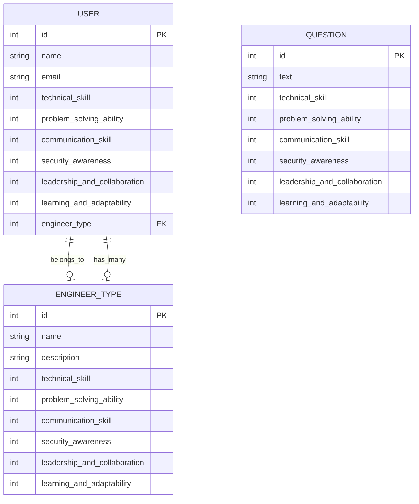

```mermaid
erDiagram
    USER {
        int id PK
        string name
        string email
        int technical_skill
        int problem_solving_ability
        int communication_skill
        int security_awareness
        int leadership_and_collaboration
        int learning_and_adaptability
        int engineer_type FK
    }
    QUESTION {
        int id PK
        string text
        int technical_skill
        int problem_solving_ability
        int communication_skill
        int security_awareness
        int leadership_and_collaboration
        int learning_and_adaptability
    }
    ENGINEER_TYPE {
        int id PK
        string name
        string description
        int technical_skill
        int problem_solving_ability
        int communication_skill
        int security_awareness
        int leadership_and_collaboration
        int learning_and_adaptability
    }

    USER ||--o| ENGINEER_TYPE : belongs_to
    ENGINEER_TYPE |o--|| USER : has_many

```
