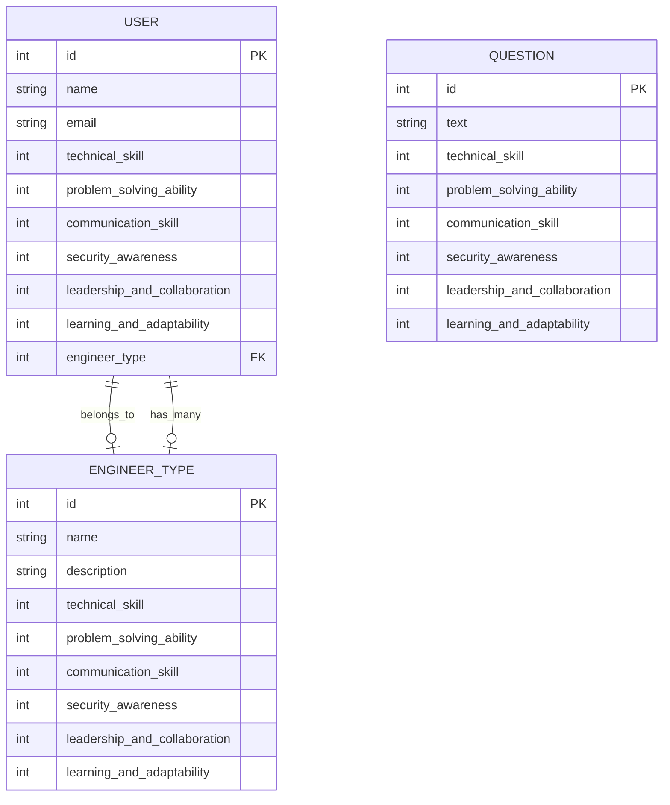

### 簡単な使い方

1. **ユーザーの取得 (GET /users)**  
   全てのユーザーを取得します。  
   `GET /users`

2. **ユーザーの作成 (POST /users)**  
   名前とメールを提供して、新しいユーザーを作成します。  
   `POST /users`  
   リクエストボディ:

   ```json
   {
     "name": "John Doe",
     "email": "johndoe@example.com"
   }
   ```

3. **ユーザーの更新 (PUT /users/{userId})**  
   特定のユーザーをIDで指定し、名前とメールを更新します。  
   `PUT /users/{userId}`  
   リクエストボディ:

   ```json
   {
     "name": "John Smith",
     "email": "johnsmith@example.com"
   }
   ```

4. **ユーザーの削除 (DELETE /users/{userId})**  
   特定のユーザーをIDで指定して削除します。  
   `DELETE /users/{userId}`

5. **質問の取得 (GET /questions)**  
   全ての質問を取得します。  
   `GET /questions`

6. **質問の作成 (POST /questions)**  
   質問のタイトルと内容を提供して、新しい質問を作成します。  
   `POST /questions`  
   リクエストボディ:

   ```json
   {
     "title": "How to use Rails?",
     "body": "Can anyone explain how to use Rails for building APIs?"
   }
   ```

7. **エンジニアタイプの取得 (GET /engineer_types)**  
   全てのエンジニアタイプを取得します。  
   `GET /engineer_types`

8. **エンジニアタイプの作成 (POST /engineer_types)**  
   エンジニアタイプの名前を提供して、新しいエンジニアタイプを作成します。  
   `POST /engineer_types`  
   リクエストボディ:
   ```json
   {
     "name": "Frontend Developer"
   }
   ```
