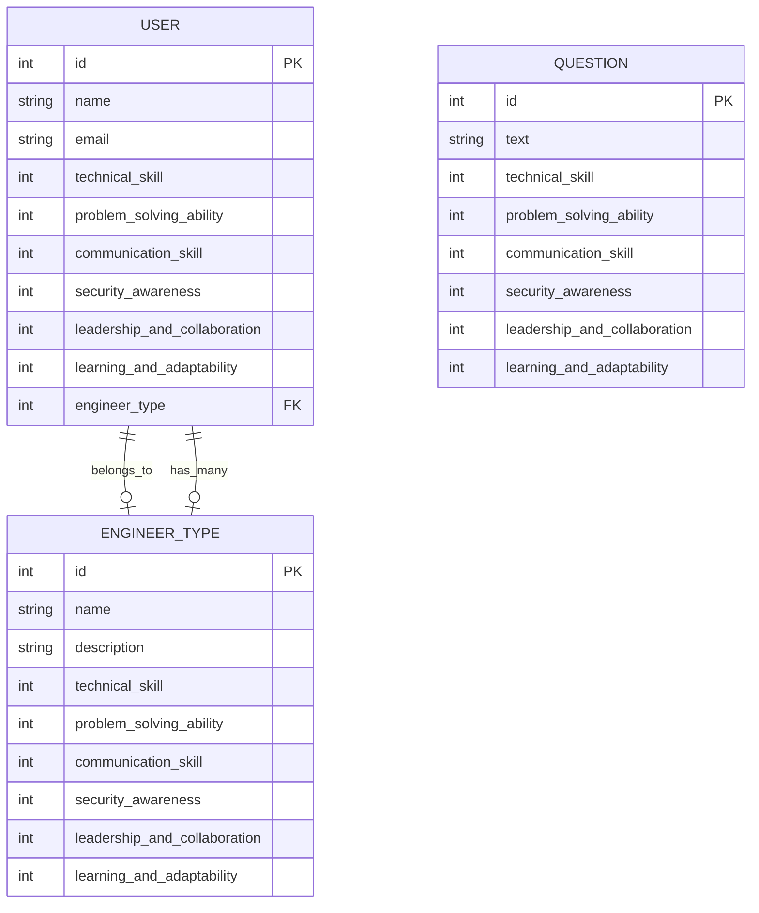

# 簡単なAPIの使い方

## 1. ユーザーの取得 (GET /users)

全てのユーザーを取得します。  
**リクエスト:** `GET /users`

## 2. ユーザーの作成 (POST /users)

名前とメールを提供して、新しいユーザーを作成します。  
**リクエスト:** `POST /users`  
**リクエストボディ:**

```json
{
  "name": "John Doe",
  "email": "johndoe@example.com",
  "technical_skill": 3,
  "problem_solving_ability": 5,
  "communication_skill": 4,
  "security_awareness": 3,
  "leadership_and_collaboration": 4,
  "learning_and_adaptability": 5,
  "engineer_type_id": 1
}
```

## 3. ユーザーの更新 (PUT /users/{userId})

特定のユーザーをIDで指定し、名前とメールを更新します。
**リクエスト:** `PUT /users/{userId}`
**リクエストボディ:**

```json
{
  "name": "John Smith",
  "email": "johnsmith@example.com"
}
```

## 4. ユーザーの削除 (DELETE /users/{userId})

特定のユーザーをIDで指定して削除します。
**リクエスト:** `DELETE /users/{userId}`

## 5. 質問の取得 (GET /questions)

全ての質問を取得します。
**リクエスト:** `GET /questions`

## 6. 質問の作成 (POST /questions)

質問のタイトルと内容を提供して、新しい質問を作成します。
**リクエスト:** `POST /questions`
**リクエストボディ:**

```json
{
  "text": "What is the best way to improve problem-solving skills?",
  "technical_skill": "Problem-solving",
  "technical_skill": 3,
  "problem_solving_ability": 5,
  "communication_skill": 4,
  "security_awareness": 3,
  "leadership_and_collaboration": 4,
  "learning_and_adaptability": 5
}
```

## 7. エンジニアタイプの取得 (GET /engineer_types)

全てのエンジニアタイプを取得します。
**リクエスト:** `GET /engineer_types`

## 8. エンジニアタイプの作成 (POST /engineer_types)

エンジニアタイプの名前を提供して、新しいエンジニアタイプを作成します。
**リクエスト:** `POST /engineer_types`
**リクエストボディ:**

```json
{
  "name": "Frontend Developer"
}
```
